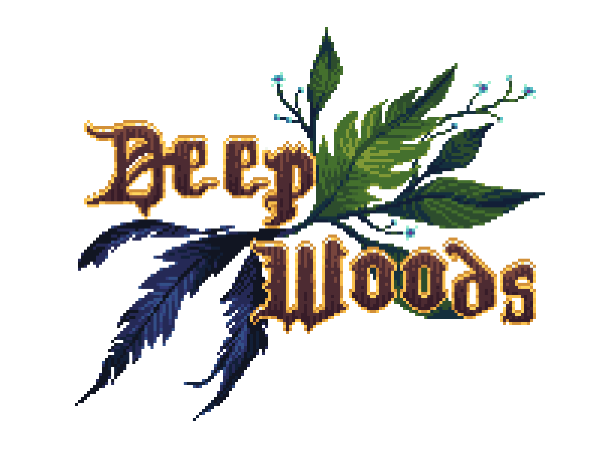

#  DeepWoods - The Game

DeepWoods The Game is a 2d pixel art puzzle and exploration game set in a vast fantastical forest.

Note that the game is in very early stage of development.

Make sure to add /Content/MonoGameExtended/MonoGame.Extended.Content.Pipeline.dll and /Content/MonoGameExtended/MonoGame.Extended.dll after installing the nuget packages.

#### Watch me make this game!

You can watch me write this code on Youtube! In my [DeepWoods The Game Devlog](https://www.youtube.com/watch?v=f0Mx7DD9cws&list=PLJG8uoq5MMESTX32G3mBtduqaZ0YHZ7rz) video series I document the making of DeepWoods The Game from scratch. Every line of code that goes into the game is documented in these videos. You can follow me for the entire dev cycle from setting up the dev tools to final release of the finished game. With every video I publish I also publish the code changes in this github repository. One commit per video, so you can easily follow along.

#### Support me!

[🍵 Ko-Fi](https://www.ko-fi.com/maxmakesmods)
[💸 Patreon](https://www.patreon.com/maxmakesmods)

---
#### Links

- Discord: [Max Makes Mods](https://discord.gg/jujwEGf62K)
- Youtube: [Max Makes Mods](https://youtube.com/maxmakesmods)

---
#### License

Permission is granted to view and study the files and source code in this repository for personal educational purposes only. Reproduction and re-distribution of any part of the files and source code in this repository is not allowed.

This project may include components that are licensed under separate third-party licenses. Those components retain their original licenses. Please refer to their respective license files for details.

Where not stated otherwise pixel art is made by the amazing [Aline Bulcão](https://www.instagram.com/dandelion.pixelart/).